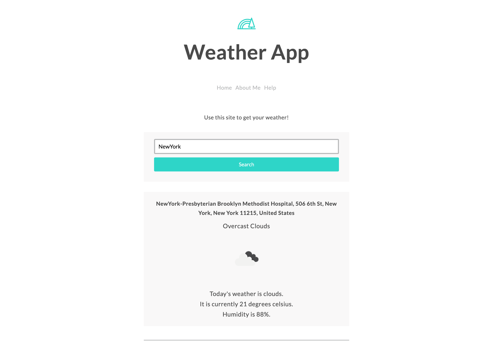

# Weather App

## About the Project

This App will allow you to get weather information by the city name you want to know about its weather.
This project is based on [The Complete Node.js Developer Course by Andrew Mead](https://www.udemy.com/course/the-complete-nodejs-developer-course-2/)
A list of commonly used resources that I find helpful is listed in the acknowledgments.

## Built With

- JavaScript, Node.js
- Handlebars
- CSS

## Table of Contents

* [About the Project](#about-the-project)
* [Built With](#built-with)
* [Live Demo](#live-demo)
* [Getting Started](#getting-started)
* [Author](#author)
* [Contributing](#contributing)
* [Show your support](#show-your-support)
* [License](#license)
* [Acknowledgements](#acknowledgements)

## Live Demo

[Live Demo Link](https://yokosaka-weather-app.herokuapp.com/)

## Getting Started

To get a local copy up and running follow these simple example steps.

1. On the project GitHub page, navigate to the main page of the repository.
2. Under the repository name, locate and click on a green button named `Code`. 
3. Copy the project URL as displayed.
4. If you're running the Windows Operating System, open your command prompt. On Linux, Open your terminal. 
5. Change the current working directory to the location where you want the cloned directory to be made. Leave as it is if the current location is where you want the project to be. 
6. Type git clone, and then paste the URL you copied in Step 3.  
e.g. $ git clone https://github.com/yourUsername/yourProjectName 
7. Press Enter. Your local copy will be created. 

## Author

👤 **Yoko Saka**

- GitHub: [@yocosaka](https://github.com/yocosaka)
- Twitter: [@yocosaka](https://twitter.com/yocosaka)
- LinkedIn: [LinkedIn](https://www.linkedin.com/in/yokosaka)

## 🤝 Contributing

Contributions, issues, and feature requests are welcome!
Feel free to check the [issues page](../../issues).

1. Fork the Project
2. Create your Feature Branch (`git checkout -b feature/AmazingFeature`)
3. Commit your Changes (`git commit -m 'Add some AmazingFeature'`)
4. Push to the Branch (`git push origin feature/AmazingFeature`)
5. Open a Pull Request

## Show your support

Give a ⭐️ if you like this project!

## 📝 License

This project is [MIT](./LICENSE) licensed.

## Acknowledgements
- [The Complete Node.js Developer Course by Andrew Mead](https://www.udemy.com/course/the-complete-nodejs-developer-course-2/)
- [Mapbox API](https://docs.mapbox.com/api/overview/)
- [OpenWeatherMap API](https://openweathermap.org/api)

